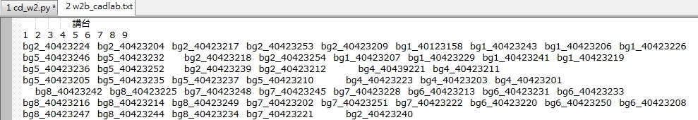
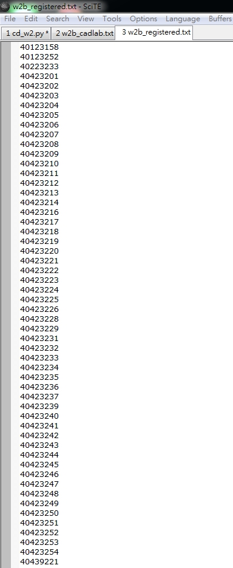
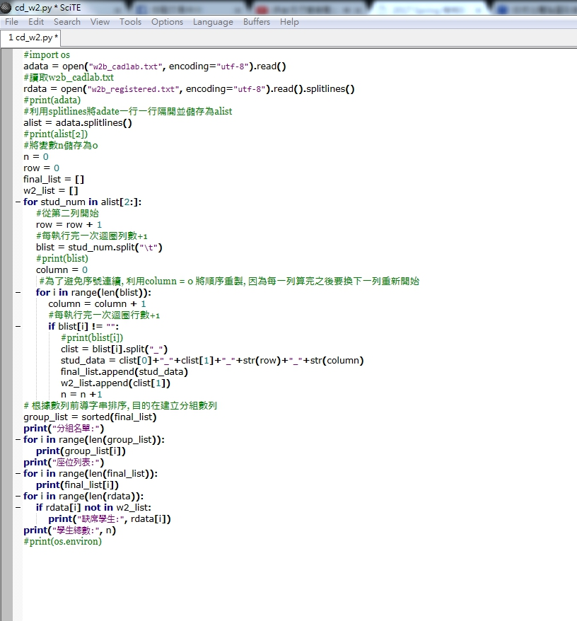
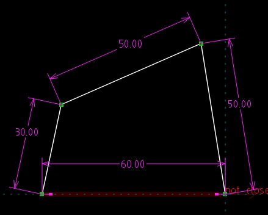
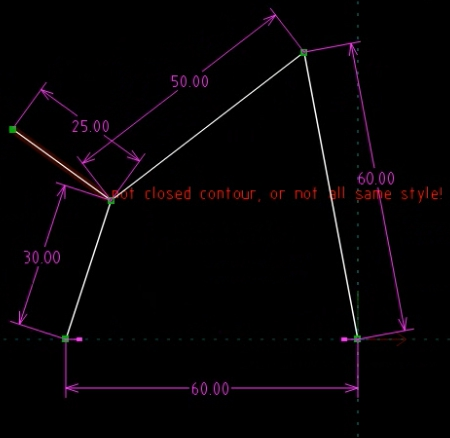
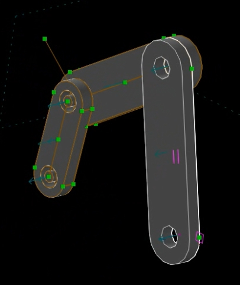
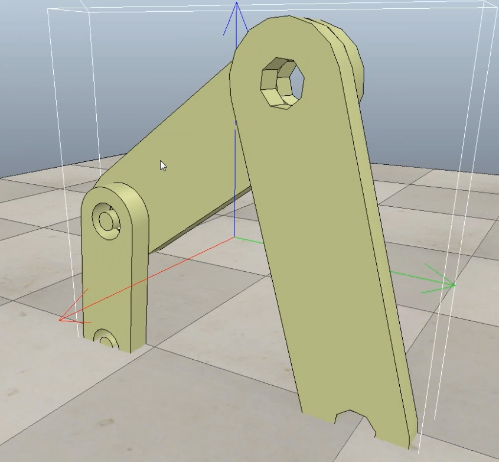
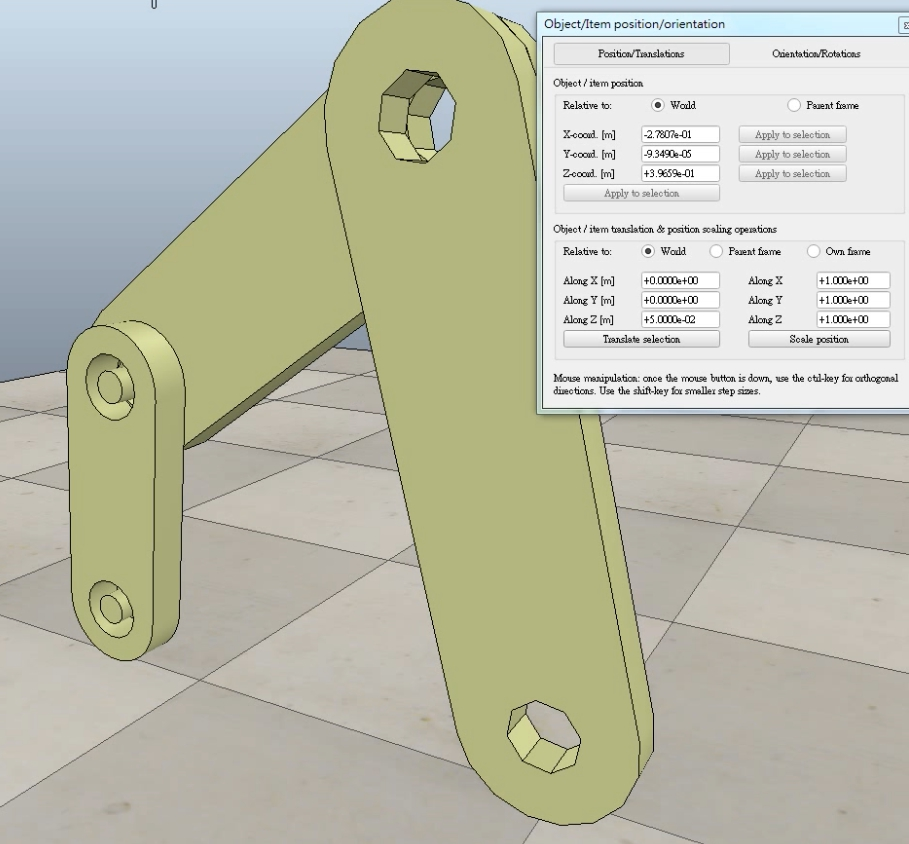

Title: Week2   20170228
Date: 2017-02-28 11:00
Category: Course
Tags: syllabus, w2
Slug: 2017spring-cd W2
Author: 40423211

<!-- PELICAN_END_SUMMARY -->
<h3>一.利用python找出缺課人員</h3>

 

 

<h3>可以下載我們的課程範例中開啟w2b_cadlab看到有在上課填坐位表的修課學生</h3>

 

 

<h3>啟w2b_cadlab可以看到有修這一門課的學生</h3>

 

 

<h3>然後可以利用w2b_cadlab這裡面的程式碼來確認修課學生的缺曠課</h3>

 

 

<h3>二.在SolveSpace畫出四連桿機構</h3>

 

 

<h3>先畫出30-50-60-60四連桿基本的尺寸</h3>

 

 

<h3>再50跟30之間畫出一條隨意尺寸的線延伸到外面</h3>

<h3>方便等一下四連桿的做動</h3>
<h3>再開起課程範例裡的連桿</h3>
<h3>利用點與點的重合、線的共線及點與面的重合，限制桿子的作動</h3>

 

 

<h3>組合完之後將四連桿機構儲存成STL檔</h3>
<h3>再使用V-rep裡的Import/Mash開啟</h3>
<h3>開啟時四連桿機構會鑲進地面</h3>

 

 

<h3>可以用object/item shift調整z軸高度(記得單位是公尺)</h3>

 

 

<h3>影片</h3>
<iframe width="560" height="315" src="https://www.youtube.com/embed/pohckQdL_1s" frameborder="0" allowfullscreen></iframe>

<h3>心得:利用python找出缺課人員再上有使用電腦的課程來進行點名的話似乎比雲端點名系統還要方便。</h3>
<h3>使用SolveSpace畫出四連桿機構也算是複習上學期所使用的東西，希望在將來的課程中可以進階的使用到SolveSpace這個軟體。</h3>