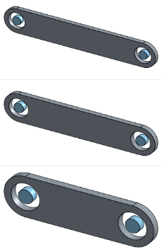

Title: Week3   20170307
Date: 2017-03-07 11:00
Category: Course
Tags: syllabus, w3
Slug: 2017spring-cd W3
Author: 40423211
<h3>本週作業</h3>
<h3>一.使用Onshape3D繪圖軟體30-50-60cm比例之四連桿機構,並以V-rep開啟</h3>
<h3>二.使用solvespace學會畫出頂點的運動軌跡。</h3>
<!-- PELICAN_END_SUMMARY -->

 

 

<h3>一.</h3>

 

<h3>首先將各尺寸的連桿實體畫出</h3>

 

<h3>再開啟組合圖</h3>
<h3>利用點與點的重合、線的共線及點與面的重合，限制桿子的作動</h3>

 

<h3>並匯出成STL檔</h3>

 

<h3>再使用V-rep裡的ImportMash開啟</h3>

 

<h3>影片</h3>
<iframe width="560" height="315" src="https://www.youtube.com/embed/qN7bP4QnZ-Q" frameborder="0" allowfullscreen></iframe>

 

 

<h3>二.</h3>

 

<h3>先畫出30-50-60-60的四連桿草圖</h3>
<h3>並在50桿子上畫出一正三角形</h3>

 

<h3>點選正三角形的頂點</h3>
<h3>並利用Analyze裡的Trace point繪製出頂點的運動軌跡</h3>

 

<h3>可以在Excel中看到頂點運動軌跡的坐標</h3>

 

<h3>影片</h3>
<iframe width="560" height="315" src="https://www.youtube.com/embed/eqLS8OjwIgM" frameborder="0" allowfullscreen></iframe>
<h3>心得:在多次練習下，已經會熟練地使用onshape裡面的鍵盤指令，相信在之後有關於onshape作業可以更有效率地完成。</h3>
