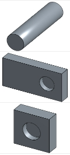
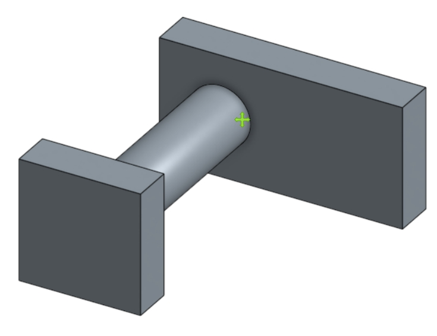
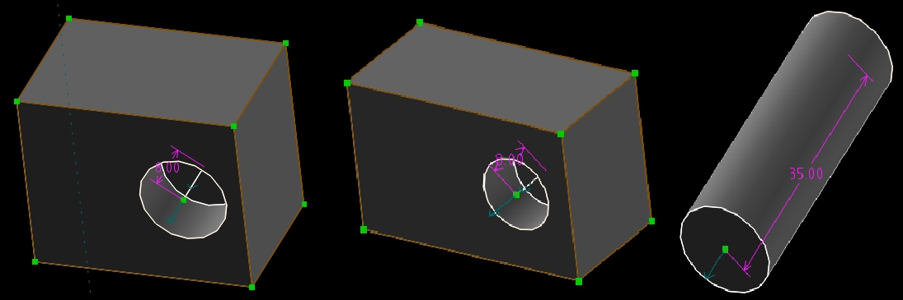
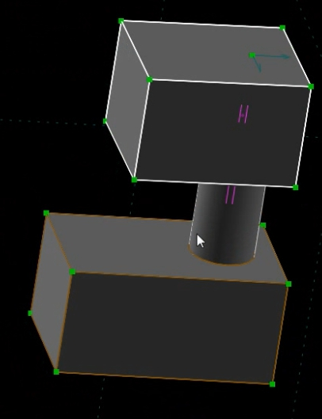

Title: Week4   20170314
Date: 2017-03-14 11:00
Category: Course
Tags: syllabus, w4
Slug: 2017spring-cd W4
Author: 40423211
<h3>本週作業</h3>
<h3>一.在Onshape繪製單連桿機構</h3>
<h3>二.在SolveSpace繪製單連桿機構</h3>
<!-- PELICAN_END_SUMMARY -->

 

 

<h3>一.</h3>

 

<h3>繪製出所需零件 ，底座、軸及單連桿</h3>

 

<h3>並將其組立起來</h3>

 

<h3>影片</h3>
<iframe width="560" height="315" src="https://www.youtube.com/embed/eqm44sarkg4" frameborder="0" allowfullscreen></iframe>

 

 

<h3>二.</h3>

 

<h3>繪製出所需零件 ，底座、軸及單連桿</h3>

 

<h3>並將其組立起來</h3>

 

<h3>影片</h3>
<iframe width="560" height="315" src="https://www.youtube.com/embed/H9Lxk_K4SlY" frameborder="0" allowfullscreen></iframe>

 

 

<h3>心得</h3>
<h3>兩個繪圖軟體的鍵盤指令都不相同，在使用過程中很容易就搞混了，希望可以經過多次練習來習慣使用他們。</h3>
