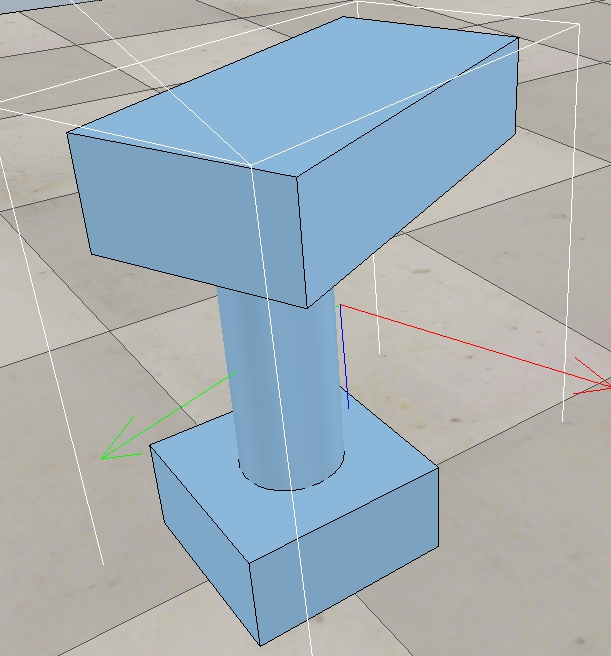
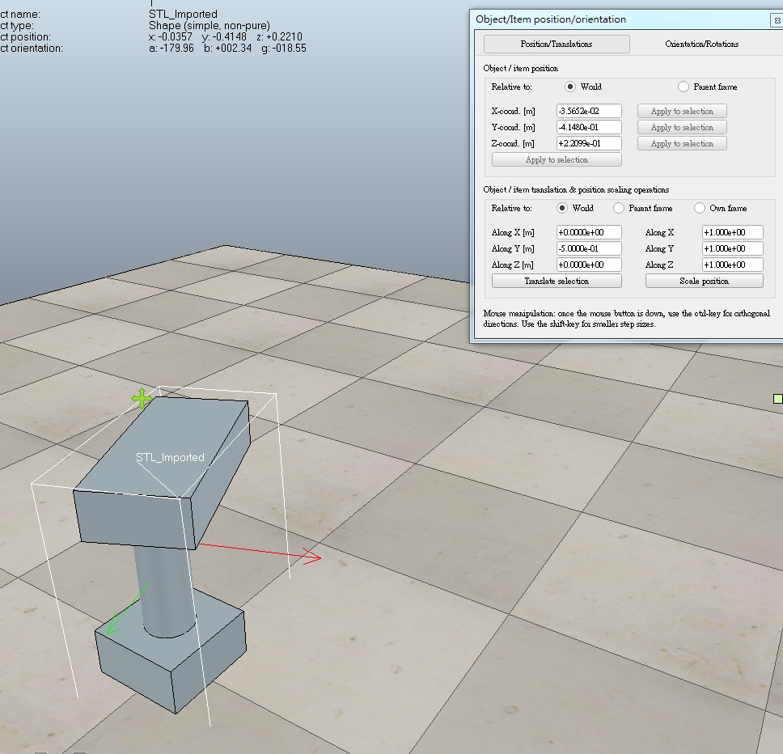
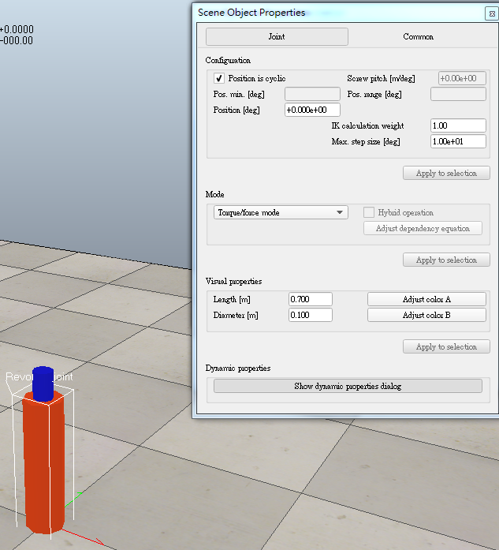
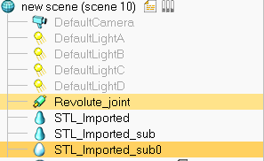
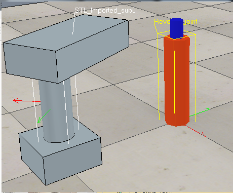
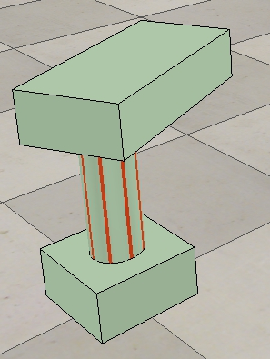

Title: Week5   20170321
Date: 2017-03-21 11:00
Category: Course
Tags: syllabus, w5
Slug: 2017spring-cd W5
Author: 40423211
<h3>本周作業</h3>
<h3>一.把Onshape繪製單連桿機構在v-rep中開啟，並使他作動。</h3>
<!-- PELICAN_END_SUMMARY -->

 

 

<h3>使用V-rep裡的Import/Mash將已經畫完的單連桿機構開啟</h3>

 

 

<h3>用object/item shift稍微調整X或Y軸</h3>
<h3>以免等等叫出的馬達卡在機構中(記得單位是公尺)<h3>

 

 

<h3>在旁邊白色地方處點滑鼠右鍵，點選add>Joint>Revolute將馬達開啟</h3>

 

 

<h3>在旁邊的馬達圖案點選兩下</h3>
<h3>點選在右邊的Length和Diameter修改成自己需要的尺寸</h3>

 

 

<h3>點選左上角Edit>Grouping/Merging>Divide selected shapes</h3>
<h3>將單連桿機構分成三個零件</h3>

 

 

<h3>再來要將馬達移位至傳動軸的位置</h3>
<h3>先點選在馬達 在按Ctrl點選傳動軸</h3>

 

 

<h3>再點選Object/Item裡的Apply to selection</h3>

 

 

<h3>之後馬達就會移位至傳動軸的位置</h3>

 

 

<h3>將傳動軸的零件抑制</h3>

 

 

<h3>並將上面的零件改成從動件</h3>

 

 

<h3>再來只要輸入自己所要的轉速就可以移動了</h3>

 

 

 

<h3>影片</h3>
<iframe width="560" height="315" src="https://www.youtube.com/embed/uxO4HiF6DaE" frameborder="0" allowfullscreen></iframe>
<h3>心得:第一次要將v-rep裡的單連桿機構作動耗費了我許多時間，但是在多次的操作下已經越來越清楚連桿機構作動的原理，在下次有關於v-rep的作業應該可以更快速地完成。</h3>

