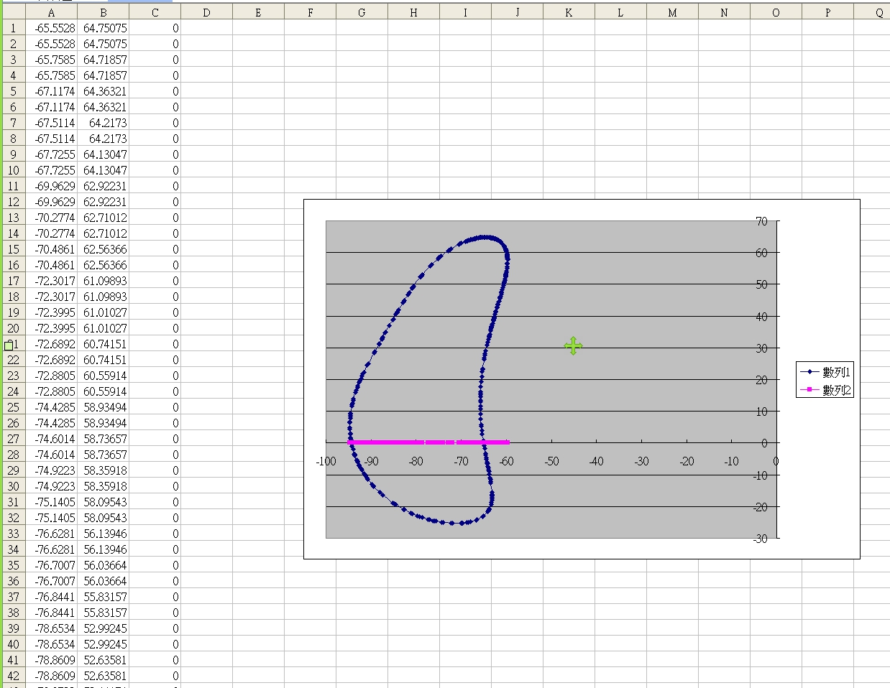

Title: 期中協同查驗與自評
Date: 2017-04-19 11:00
Category: Course
Tags: syllabus, w10
Slug: 2017spring-cd W10
Author: 40423211
<h3>一.四連桿機構協同 Trace Point 查驗</h3>
<h3>二.繪製連桿機構並使他作動</h3>
<!-- PELICAN_END_SUMMARY -->

 

 

一.
<h3>(1)利用solvespace進行點路徑的分析</h3>

 

 

<h3>(2)用Excel進行點的分析</h3>

 

 

<h3>(3)利用程式繪製路徑</h3>
<!-- 導入 Brython 標準程式庫 -->
 

 
<!-- 啟動 Brython -->
 

 
<!-- 以下實際利用  Brython 畫四連桿 trace point 路徑-->
 
<canvas id="fourbar" width="600" height="400"></canvas>
 

 

 

 

<h3>影片</h3>
<iframe width="560" height="315" src="https://www.youtube.com/embed/Uxu52BKjVnk" frameborder="0" allowfullscreen></iframe>

 

 

二.
<h3>(1)多連桿機構零件繪製</h3>

 

<h3>影片</h3>
<iframe width="560" height="315" src="https://www.youtube.com/embed/1rK-meqic08" frameborder="0" allowfullscreen></iframe>
<h3>(2)多連桿機構零件組合</h3>

 

<h3>影片</h3>
<iframe width="560" height="315" src="https://www.youtube.com/embed/4Q9AXYTjSDI" frameborder="0" allowfullscreen></iframe>
<h3>(3)多連桿機構零件作動</h3>

 

<h3>影片</h3>
<iframe width="560" height="315" src="https://www.youtube.com/embed/wGXBj0ICEZ4" frameborder="0" allowfullscreen></iframe>
